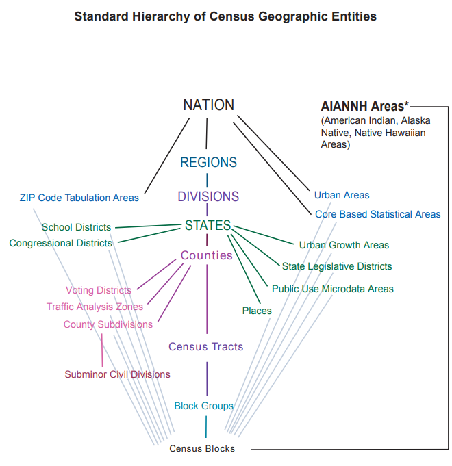

# Lecture Overview

This lesson will review some of the core aspects of spatial demographic research. It will introduce you to some historical aspects of the field, conceptual issues that demographers face when considering space and place in their research, and review commonly used levels of geographic information used by spatial demographers. 


### Objectives
At the end of this lesson, you will be able to:

1) To define and explain some of the main conceptual perspectives used in spatial demography.

2) To Identify, describe, and illustrate the various types of geographic space that are commonly used in social science research.

3) To use R to extract various census geographic levels to illustrate nesting and levels of census geography


### Readings
The readings below should be read prior to working through the lesson.

In the process of reading these articles, focus on the following questions:
1) What types of topics have spatial demographic analyses focused on in the past?
2) What levels of analysis are mentioned in these articles? Do studies focus more on individuals or places?

Castro, Marcia. 2007. "Spatial demography: An opportunity to improve policy making at diverse decision levels." Popul. Res. Policy Rev. 26 (5-6): 477-509. doi:10.1007/s11113-007-9041-x.

Entwisle, Barbara. 2007. "Putting people into place." Demography 44 (4): 687-703. doi:10.1353/dem.2007.0045.

Voss, Paul R. 2007. "Demography as a spatial social science." Popul. Res. Policy Rev. 26 (5-6): 457-76. doi:10.1007/s11113-007-9047-4.


# Spatial demography defined 
In her paper, Marcia Castro [@DeCastro2007] provides an excellent discussion of what spatial demography may be considered, and to abstract her discussion, we may provide a succinct definition of spatial demography as:

*An statistical analysis of population data that has a formalized representation or consideration of space or place* 

This includes much of what Castro cites as the prerequisites for "spatial demography", including the fact that we are conducting some form of statistical analysis, and that said analysis is conducted with a methodology that formally deals with the spatial nature of our data. Reasons why we must consider the spatial, or place-based aspect of our data are discussed below.


### Spatial data as behavioral data 
Spatial information is a key attribute of behavioral data. The activities of daily living happen within certain spaces and places, such as how you get to work in the morning and where you choose to live. This adds a potentially interesting attribute to any data we collect, because we can potentially characterize human behavior by where certain types of activities happen, where groups of people interact and where key events in our lives occur. For instance, in the course of your daily life, you probably go to certain places nearly every day (work, home), while some days you may go somewhere special, such as the grocery store or the movies, which you don't do every day. Thinking about where these places are, how they are connected and how the connections among them influence how you live your life are all things that spatial demographers may be interested in.

\newpage
## Scales of thinking in spatial analysis 

We have to be aware that data in demography come from a variety of spatial scales. Demographers deal with problems from national level to person level in nature. We can make broad characterizations of such data in terms of macro or micro scale of the data. 

### Macro - demography
Paul Voss[-@Voss2007a] describes most demography (and certainly most demographic studies prior to the 1970's and 1980's) as **Macro demography**. Voss also mentions that prior to the availability of individual level microdata, all demography was macro-demography, and most demographic studies were spatial in nature, because demographic data were only available in spatial units corresponding to administrative areas. Typical types of geographic areas would be counties, census tracts, ZIP codes, state or nations. 

In the macro-demographic perspective on spatial demography, observations are areas, or aggregates of individuals. Typically analyses studying the interaction among these *areas*. This presents an attractive view of populations and typically data on places are more widely available, but there are caveats we must be aware of. 

  - We can not really get at variation within these areas. This is because we do not observe individuals, only counts of the number of persons or events of interest within some geographic area. 
  
  - An example of this would be: We measure the number of deaths in a county, not the individual deaths themselves. This is important because the level of detail is less for the aggregate count than for the individual death record.
    
  - In social science, we often refer to such analyses as **ecological** in nature, and we are analyzing places, and not individual people. In doing this we are typically looking for trends and associations at the population level. In terms of causality, it is often weak at best, so many of these studies are purely correlational.
   
In a macro - level study of mortality, a researcher may make ask:
*Do places with lower levels of healthcare resources have higher mortality rates*

This speaks directly about places themselves, and according to a macrodemographic perspective would be considered spatial demography.

\newpage
### Micro - demography 
Demographic studies began to focus on individual level outcomes once the availability of individual level census and social/health survey data became more prevalent in the 1960's and 1970's. Corresponding with this availability of individual level data, spatial demography began to be influenced by sociological thought, which brought a proper theoretical perspective to demographic studies, which, before this period were dominated by methodological issues and descriptions of macro scale demographic processes. 

In contrast to the macro-demographic perspective outlined above, the micro-demographic perspective is focused on the **individual** rather than the aggregate. Barbara Entwisle [-@Entwisle2007a] explains, micro-demography focuses on how individuals are modeled within spatial demographic studies. 

  - Individual level behaviors and outcomes are of prime importance, and most hypotheses are related to how the individual outcome or behavior is influenced by characteristics of the individual. 

For instance, in a micro-demographic study of mortality, the researcher may make ask:
*Do individuals with a low level of education face higher risk of death, compared to people with a college education*

This in and of itself says nothing about the spatial context in which the person lives, it is only concerned with characteristics of the person. From a spatial demographic perspective, this, by itself would not be considered a spatial study.

\newpage

### Multilevel Demography
Once the availability of individual level data became wide spread, individual level demographic studies became prolific and extended into many sub-fields. Beginning in the late 1980's and 1990's more researchers began to realize that many individual level outcomes can be affected by conditions external to the person themselves. By combining information on the neighborhoods where people lived, more complex questions about the origins of many health outcomes, specifically, began to emerge. These types of studies, which include both micro and macro-level data in their scope are referred to as **Multi-level** analyses.

  - Multi-level studies typically involve individual level outcomes measured from some survey mechanism, and these studies typically add either information on the neighborhood where the respondents live, or a characteristic of the family where they were raised, or currently reside. These characteristics often take the form of some measure of place-based heterogeneity. In terms of neighborhood conditions, these are often measured from information collected by the Census Bureau.
  
In contrast to both micro and macro level studies, a multi-level analysis will include language about the hypothesized relationship at both levels: 
*Do individuals with lower levels of education, living in places with lower levels of healthcare resources, will face higher risk of death?*

So, multilevel studies explicitly contextualize people within places, and in a way, blend the macro and microdemographic perspectives. 

**Practice question**
To review the concepts discussed above, here is a research question, you need to describe what kind of data (micro, macro or multi-level) would be necessary to answer it and why.
Question: "How does the distance to the nearest health clinic affect the risk of inadequate prenatal care?"
Answer: Multi-level data are needed, because the outcome (prenatal care adequacy) is a characteristic of an individual woman, but distance to the nearest clinic is an area-level or place-level characteristic, so we need data on multiple levels to answer the question. 


# References


## Common types of spatial data
In this part of the lesson, we will examine several common levels of U.S. Census geography. The Census Bureau provides a hierarchy of these data in their publication [Standard Hierarchy of Census Geographic Entities](http://www2.census.gov/geo/pdfs/reference/geodiagram.pdf), which depicts how the various types of geography that the Census captures are nested within each other. *See the diagram below*. For example, the nation is the largest level of Census geography, and it subsumes all other geographies within it. Also, census tracts contain block groups, which contain census blocks. The census block is the smallest level of Census geography.


The diagram also illustrates that not all geographies are nested within each other. For example, tracts *are not* nested within places, but blocks *are* nested within places. Likewise, ZIP codes and school districts only have blocks nested within them. 

On the next few pages, we will examine examples of nested and unnested geographic entities in the state of Texas. For now, just be aware that, depending on the type of analysis you are trying to do, your options for data availability may be limited, based on the geographic level you are using. 

\newpage
## Using R to extract Census geographic data 
Below is some R code that loads the `tigris` package [@Walker2018] and uses it to download several layers of geographic data, corresponding to the levels of states, ZIP codes, counties, Census tracts, Census designated places and Census blocks. This code is for Texas, but it can be modified to obtain the data for other states. 

**Code description**
In this code, we first use the `states()` function to extract all state level geographies in the US, and subset to just have the Texas state polygon. The, we download ZIP codes using `zctas()`, counties using `counties()`, census tracts using `tracts()` and finally census blocks using `blocks()`. By changing the state, county and year arguments, we can get the various geographies for different levels of nesting. You need to know the county FIPS codes if you want specific county data. 

You can copy this code into RStudio as you go through this example to see it in real time. In order to run these codes on your own computer, you need to install some packages first. The packages you need to install are: `tigris, spdep, sp, ggplot2`.

```{r getpa_maps, echo=TRUE, message=FALSE, warning=FALSE, fig.height=7, fig.width=9,results='hide'}
library(tigris)

#All states
txst<-states(cb =T) 

#Just Texas
txst<-txst[txst$STUSPS=="TX",]

#All ZIP codes in Texas
txzip<-zctas(state = "TX", year = "2010")

#All Counties in Texas
txcnty<-counties(state="TX" , refresh=T, cb = T)

#Bexar County TX
bexar<-txcnty[txcnty$COUNTYFP=="029",]


#All Census tracts in Texas
txtractt<-tracts(state = "TX", refresh=T, cb = T)

#Bexar county tracts
sc_tract<-txtractt[txtractt$COUNTYFP=="029",]

#All blocks in Bexar County, Texas
txbl<-blocks(state = "TX", county = "029", year = "2010")

```

\newpage
## Nested Geographic Entities 

Now, the nesting of geographies can be seen. 

Let's first visualize counties within the state of Texas. *See the image below.* It is clear that all counties are nested within the state boundary.

Note that `lwd=6` makes a thicker line for plotting, and `col="red"` draws the lines as red, versus black. Also, the data are downloaded as [simple features](https://en.wikipedia.org/wiki/Simple_Features), but we can convert them lines for plotting using `as(txst, "SpatialLines")`.

```{r}
library(sf)
library(ggplot2)

ggplot(txst)+
  geom_sf(col = "blue", lwd = 2)+
  geom_sf(data=txcnty, col ="#1f78b4" )

```

We can also see that all census tracts are nested within counties. Let's visualize tracts within Bexar county, TX. *See the image below.*:

```{r}
ggplot(bexar)+
  geom_sf(col = "blue", lwd = 2)+
  geom_sf(data=sc_tract, col ="#1f78b4" )


```

\newpage
## Non-Nested Geographic Entities 

However, not all geographic levels overlap. 

Let's visualize ZIP codes and Census tracts in downtown San Antonio, Texas. *See the image below.* The tracts are green lines, and the ZIP codes are blue lines. We see that these two areas do not overlap at all, so tracts are not nested within ZIP codes.: 

```{r}
#get the geographic extent of the 78249 zip code
bb<-txzip[txzip$ZCTA5CE10=="78249",]

ggplot(bexar)+
  geom_sf(col = "blue", lwd = 2)+
  geom_sf(data=txtractt[txtractt$COUNTYFP=="029",] )+
  geom_sf(data=bb, fill=NA , color="red")

```
```{r, eval = FALSE}
library(mapview)

mapview(txtractt[txtractt$COUNTYFP=="029",])+mapview(bb)
```

However, Census blocks are nested within ZIP codes. Let's now visualize ZIP codes and Census blocks in downtown State College. *See the image below.*

It is hard to see, because blocks are so small, but all of the blue lines are contained within the red line (ZIP code 78249), meaning that the boundary of ZIP code 78249 is also composed of lines that make up some of the blocks within Bexar county, TX.:

```{r}

ggplot(data=bexar)+
  geom_sf(col="red")+
   geom_sf(data=txbl[txbl$COUNTYFP=="029",],
           fill=NA,
           color="blue")+
  geom_sf(data=txzip[txzip$ZCTA5CE10=="78249",],
          fill=NA,
          color="black",
          lwd=3)
 

```


It is hard to see, because blocks are so small, but all of the blue lines are contained within the red line (ZIP code 78249), meaning that the boundary of ZIP code 78249 is also composed of lines that make up some of the blocks within Bexar county, TX.

```{r, eval = FALSE}
library(mapview)

mapview(txbl[txbl$COUNTYFP=="029",])+mapview(bb, color="blue")
```

# References

\newpage
### Coding Practice 
In this practice example you will use R to extract geographies for the state of New Jersey.

```{r getpa maps, echo=TRUE, message=FALSE, warning=FALSE, fig.height=7, fig.width=9,results='hide', eval = FALSE}
library(tigris)
njst<-states(cb = FALSE)
njst<-njst[njst$STUSPS=="NJ",] #select NJ from all states
```

```{r,results='hide', eval = FALSE}
njcnty<-counties(state="NJ" , cb=T,refresh=T) #all counties in NJ
plot(njcnty[, "COUNTYFP"], main="New Jersey County Geographies")
```

```{r,results='hide', eval = FALSE}
njtractt<-tracts(state = "NJ",cb=T, refresh=T) #all census tracts in NJ
plot(njtractt[,"COUNTYFP"], main="New Jersey Census Tract Geographies")
```

```{r,results='hide', eval = FALSE}
njbg<-block_groups(state="NJ",cb=T, refresh=T) #all block groups in NJ
plot(njbg[, "COUNTYFP"], main="New Jersey Census Block-Group Geographies")
```

## Summary  
In this lesson we have reviewed the nature of commonly used Census geographic boundaries. These are very useful because they are commonly used to disseminate data from the federal government. Census geographic information is often commonly included in national survey data as well, allowing us to link individual level survey responses to spatial information on where the places are located. We also saw that, while many census geographies are nested within one another, there are some that are not nested within one another. These are special cases that we must always be aware of, because they can limit the types of data which are available for a given area. 


